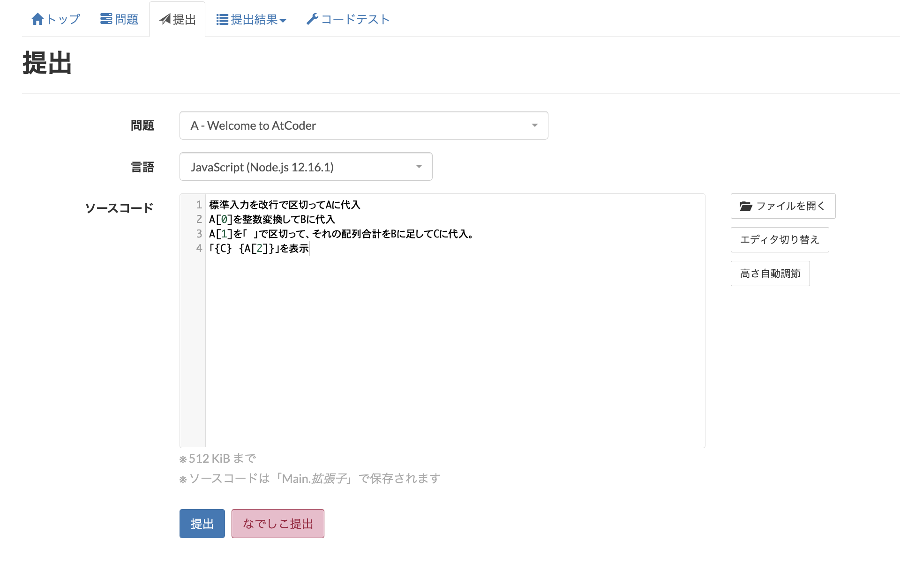
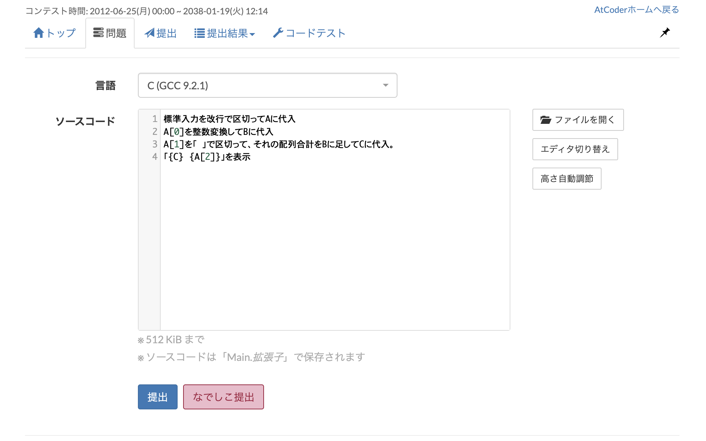
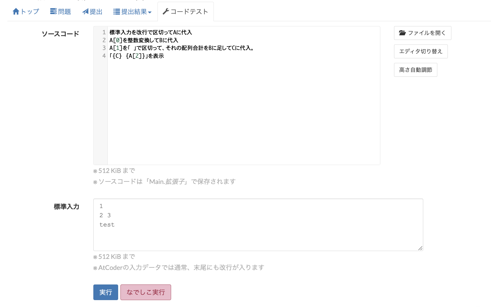

[](https://chrome.google.com/webstore/detail/pbhmgehdalachojhgbpnelagkfkoclfb?authuser=0&hl=ja)
[](https://github.com/axt-one/nadesicoder/blob/master/LICENSE)
[](https://twitter.com/intent/tweet?text=Wow:&url=https%3A%2F%2Fgithub.com%2Faxt-one%2Fnadesicoder)  

「なでしこーだー」は日本語プログラミング言語「[なでしこ](https://nadesi.com/top/)」で[AtCoder](https://atcoder.jp/)の問題を解くためのchrome拡張機能です。  
ブラウザで動かすことのできる「[なでしこ３](https://nadesi.com/doc3/)」の言語エンジンを利用して、なでしこ３で書いたコードを自動でJavaScriptに変換することでAtCoderに提出します。  
なでしこ３の文法は[なでしこ３公式マニュアル](https://nadesi.com/v3/doc/index.php)を参照してください。  
なでしこーだーにおける標準入力の取得方法は[使い方](#使い方)を参照してください。



注：「なでしこーだー」はなでしこ、AtCoder共に非公式です。

## 対応バージョン
- なでしこv3.3.55

## インストール方法
1. chromeを起動し、chrome ウェブストアで[なでしこーだーのページ](https://chrome.google.com/webstore/detail/pbhmgehdalachojhgbpnelagkfkoclfb?authuser=0&hl=ja)を開きます。
2. 「chromeに追加」をクリックし、chromeへのインストールを許可します。

## 使い方
AtCoderのコンテストページを開くと自動的に「なでしこーだー」が起動します。
### なでしこ３で書いたコードを提出する



コンテストの「問題」ページもしくは「提出」ページを開き、「提出」ボタンの横に「なでしこ提出」ボタンが表示されていればOKです。  
エディタになでしこ３でソースコードを書き、「なでしこ提出」ボタンをクリックすると自動でJavaScriptに変換されて提出されます。AtCoderの言語欄は特に変更する必要はありません。


### なでしこ３で書いたコードをテストする



「なでしこーだー」はAtCoderのコードテストにも対応しています。コンテストの「コードテスト」ページを開くと「実行」ボタンの横に「なでしこ実行」が表示されます。  
エディタになでしこ３でソースコードを書き、「なでしこ実行」ボタンをクリックすると自動でJavaScriptに変換されて実行されます。AtCoderの言語欄は特に変更する必要はありません。


### 標準入力を取得する
AtCoderは標準入力を受け取り、解答を標準出力する形式の問題が出題されますが、「なでしこーだー」で使用しているweb版のなでしこ３（wnako3）は標準入力を受け取る機能がありません。そのため「なでしこーだー」では標準入力を受け取る独自の関数「標準入力」を設定しています。関数「標準入力」は、一度にすべての標準入力を受け取り、その文字列を返します。複数行の入力がある場合も改行記号を含む一つの文字列が返ります。

#### 例１

ソースコード
```なでしこ３
標準入力を整数変換して、それに10を掛けて表示
```
入力
```
3
```
出力
```
30
```

#### 例２

ソースコード
```なでしこ３
標準入力を改行で区切ってAに代入。
Aの配列合計を表示
```
入力
```
1
2
3
```
出力
```
6
```

### 標準出力
上の例にあるように標準出力は「表示」命令を使うことができます。
「コンソール表示」命令でも同じ結果になります。